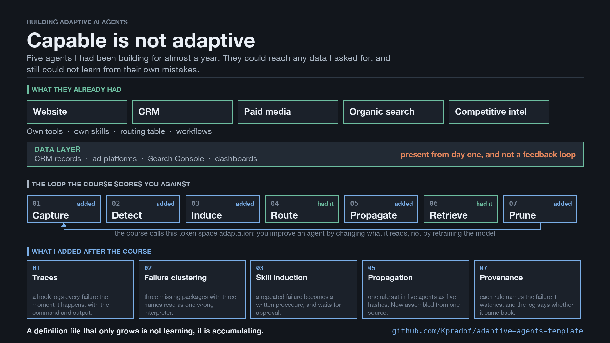

# Adaptive Agents Template

A structure for a multi-agent system that learns from its own mistakes, and a
script that tells you how far your current one is from it.



*One page of it, if you would rather skim: [docs/one-pager.pdf](docs/one-pager.pdf).*

This came out of auditing a real system: five Claude Code agents, one per
business domain, 25 skills, 6,923 lines of markdown written by hand over
almost a year. It had never been audited. Nothing in it had ever been deleted.

---

## Accumulative is not adaptive

An agent gets a rule when something goes wrong. Someone writes the lesson into
its definition file, and next time it behaves better. That works, and it feels
like learning.

It is not learning. It is accumulation, and the two look identical from the
inside because both produce more text.

The difference shows up in what is missing:

- nobody finds the failures that nobody noticed
- a rule learned by one agent never reaches the others that need it
- no rule is ever measured, so no rule is ever removed

A file that only grows eventually holds rules that contradict each other, rules
about tools that no longer exist, and rules nobody can account for. The agent is
not smarter for having them. It is slower, and less predictable.

---

## The loop, in seven steps

Adaptation is a cycle. Each step feeds the next, and the last one feeds back.

| # | Step | What it does | What breaks without it |
|---|------|--------------|------------------------|
| 01 | Capture | records each failure as it happens, with its context | nothing to learn from |
| 02 | Detect | groups the failures that repeat, unprompted | only noticed failures get fixed |
| 03 | Induce | turns a repeated failure into a written rule | the same mistake is re-explained forever |
| 04 | Route | files the rule where it belongs | one landfill file nobody reads to the bottom of |
| 05 | Propagate | gives the rule to every agent it applies to | each agent learns alone, five times over |
| 06 | Retrieve | loads the rule when it applies | rules exist and are never read |
| 07 | Measure and prune | removes what did not help | the definition grows without limit |

Steps 1 through 6 each add something and are satisfying to build. Step 7 only
takes things away, which is why it is the one that never gets built, and why
most systems stall at "accumulative".

**Step 7 is not a scoring model.** The minimum version is a date. Every rule
records the failure that produced it and the last time that failure recurred. A
rule whose failure has not come back is either working or unnecessary, and those
two are distinguishable only by removing it and watching. A rule that cannot be
removed was never measured.

---

## Find out where you are

```bash
python3 scripts/audit_structure.py /path/to/your/agents
```

No traces, no API key, no LLM. Every check is a property of how the files relate
to each other, so it runs on day one.

It reports, per step:

- **05** sections that appear in more than one agent, split into identical
  copies (cheap: one edit per copy, and the last one gets forgotten) and drifted
  copies (expensive: the same heading now means different things). Then the
  rules that propagated partway, which are the ones learned once and never
  handed on.
- **07** whether anything in the system can retire a rule, and which rules carry
  a date nobody has revisited.
- **04** agents referenced by name as owners that were never written, and skills
  whose descriptions overlap enough that the model has to guess between them.

Real output from the system this came from:

```
[05] PROPAGATE
  shared from one source, assembled into each agent:
    4x  Before reporting, verify
  same heading, different content (the expensive one):
    5 copies / 5 variants  Plan first  <- not in shared/base.md yet
  rules that propagated partway: 3
    4/5 agents, missing from the paid agent
      every path and ID in the plan verified, not remembered

[07] MEASURE & PRUNE
  pruning mechanisms found: 1   (a note about a deprecated API, not a rule)
  dated rules: 16, 2 older than 60 days

[04] ROUTE
  every agent referenced as an owner exists
```

Note what it does *not* report: `What you cover` and `Workflow` also appear in
several agents and are supposed to differ, so they are not findings. The audit
separates the two by how much the copies share. A rule reworded per domain keeps
most of its lines; a per-domain section keeps almost none. `shared/base.md` is
the declaration of what should match, and with no such file everything repeated
is reported as a candidate instead.

The rule that propagated partway to four of five agents: *verify every path and
ID before asserting it, because plans hallucinate paths.* The agent that never
got it is the one that plans budget changes.

---

## The structure

```
agents/
  <domain>/<name>.src.md     what is specific to this agent: scope, routing,
                             what it does NOT cover, who owns the rest
  <domain>/<name>.md         GENERATED. what the harness loads.
shared/
  base.md                    rules every agent obeys. one copy, never pasted.
skills/
  <name>/SKILL.md            a procedure, loaded on demand by a routing table
data/
  raw/                       frozen transcripts, for auditing a system that had
                             no log running yet. gitignored.
evals/
  tasks.json                 tasks to re-run before and after approving a rule
skillbox/
  proposed/ approved/ rejected/
hooks/
  record-failure.sh          01  logs every failure the moment it happens, to
                                 ~/.claude/incidents.jsonl. It fires from
                                 whatever directory the agent is working in, so
                                 the log lives at a fixed path rather than in
                                 this repo. Set INCIDENTS_LOG to move it; the
                                 reading scripts follow the same variable.
  block-generated-agents.sh  05  refuses edits to a generated agent file
skills/
  induce-rules/              03  clusters into proposed rules, for approval
scripts/
  cluster_incidents.py       02  groups the failures that repeat
  measure_rules.py           07  has each rule's failure happened again?
  seed_rules.py              07  seeds RULES.md from rules already written
  audit_structure.py         05 07  the gap audit, no traces needed
  build_agents.py            05  assemble each agent from its source + shared
  snapshot_traces.py         01  fallback: freeze transcripts on a system that
                                 had no log running yet
  to_episodes.py             02  fallback: turn those transcripts into episodes,
                                 for auditing a past the hook never saw
RULES.md                     every rule: when added, from which failure, when
                             last confirmed useful
```

### Why agents are generated, not edited

Shared rules pasted into each agent are the single most common cause of drift.
Four identical copies cost four edits and the fourth gets forgotten. Five
diverging copies are worse: a rule improved in one agent never reaches the rest.

A reference (*"the shared rules live in shared/base.md"*) is not enough, because
an agent's own file is always in context while a referenced file is only read if
something decides to read it. So the text is assembled in, physically, from one
source:

```bash
python3 scripts/build_agents.py          # write the agent files
python3 scripts/build_agents.py --check  # verify they match; for a pre-commit hook
```

One source, many outputs. Edit `shared/base.md` once and every agent has it.

**The frontmatter must stay at line 1.** The banner marking a file as generated
goes after the closing `---`, never before it. Put anything above the
frontmatter and the harness stops reading `name`, `description` and `tools`, and
the agent silently fails to register. This does not raise an error.

**Generating files creates a new way to lose work**, and it needs its own guard:
edit the generated `<name>.md` and the change works until the next build wipes
it, with no warning. `--check` in a pre-commit hook catches that, but only in a
git repository. For agents that live in a synced folder instead, `hooks/` ships
a `PreToolUse` hook that refuses the edit at the moment it is attempted:

```json
{
  "hooks": {
    "PreToolUse": [{
      "matcher": "Edit|Write",
      "hooks": [{ "type": "command",
                  "command": "\"$HOME/.claude/hooks/block-generated-agents.sh\"",
                  "timeout": 5 }]
    }]
  }
}
```

It only refuses files carrying the GENERATED banner, so `.src.md`, `shared/base.md`
and every skill stay editable, and it answers with the file to edit instead.

### How this maps to the course

The seven-step framing comes from DeepLearning.AI and Oracle's *Building
Adaptive AI Agents*. What is here is not a reimplementation of its labs, and the
differences are deliberate:

| The course | Here | Why |
|---|---|---|
| Traces stored as episodes in a vector-backed agent memory | an append-only incident log | The traces expire before they can be mined, and recording at the moment of failure keeps the context that mining later throws away. |
| An LLM induction engine over episodes | mechanical clustering, then a skill that drafts | Grouping does not need a model and is better off deterministic. The judgement does, and that is where the skill sits. |
| A versioned Skill Box, proposed to approved to active | `RULES.md`, one entry per rule with a status | The skills already existed. What was missing was the behavioural rules around them, which is a different artifact. |
| Vector search over indexed skills | the routing table each agent already declares | Retrieval was not the bottleneck. Do not replace what works. |
| A lift eval: rerun the task, confirm it improved | `measure_rules.py`: has this failure recurred since the rule? | The same question, answered from the log instead of from a manual rerun, so it can be asked of every rule at once. |

The last row is the one worth arguing about. A rerun proves a rule helps on a
task you chose; the log shows whether the failure stopped happening in the work
you actually did. The second is weaker evidence per rule and far cheaper across
all of them, which is what makes it get run.

### Why `RULES.md` exists

It is the only file that makes step 7 possible. Each entry:

```markdown
### verify paths before asserting them
- added: 2026-08-14
- from: a plan that referenced three files that did not exist
- applies to: all agents
- last confirmed: 2026-09-02 (same failure recurred in the paid agent)
```

A rule with no `from` cannot be measured, because there is no failure to watch
for. A rule whose `last confirmed` is old is the first candidate for removal.

---

## Two traps worth knowing before you start

**The error flag under-reports.** Claude Code marks a tool result with
`is_error`, but a shell command can exit 0 while printing a traceback, so the
flag misses those. In the audited corpus: 23 flagged, 12 more that were not.

**The fix over-reports.** Searching the output text for error patterns catches
the silent ones and invents others: a file containing `except ImportError` is
error handling, a script printing the word `FAILED` is reporting, and a `diff`
returning exit 1 means the files differ, which is `diff` working. Hand-reading
those 12: five were not failures at all.

So neither signal means "the agent made a mistake". The label has to be about
intent, which is why `data/labeled/` exists and why the sample is read by a
person before any detector is trusted.

**Traces delete themselves.** During one afternoon of this audit the corpus went
from 10 transcripts to 8, and the two largest erased themselves mid-count. Any
number measured against the live directory stops being reproducible within days.

That is why capture is a hook, not a mining job. `hooks/record-failure.sh` writes
each failure to a log the system owns, at the moment it happens, with the command
and the output attached. Mining transcripts later inherits both problems at once:
the evidence expires, and what counted as a failure has to be guessed from a flag
that is wrong in both directions. Recording at the moment of failure has neither.

The same hook also records a **candidate**: a command that exited 0 while printing
something error-shaped. It is logged separately and never counted, because it is
a real failure about half the time. A person reads the example and decides.

---

## Where this came from

The seven-step framing is a reading of DeepLearning.AI and Oracle's *Building
Adaptive AI Agents*, whose L2 covers skill induction from traces (steps 1, 2, 3
and 6) and human review before a proposal becomes behavior. Steps 5 and 7 are
what the audit found missing from a real system, and are the parts this template
adds structure for.
